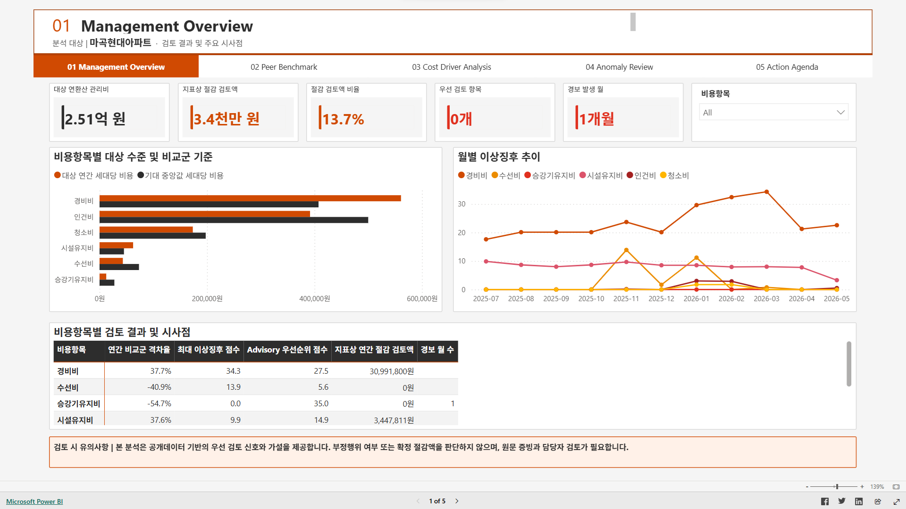
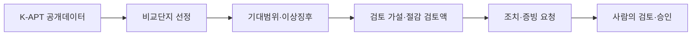
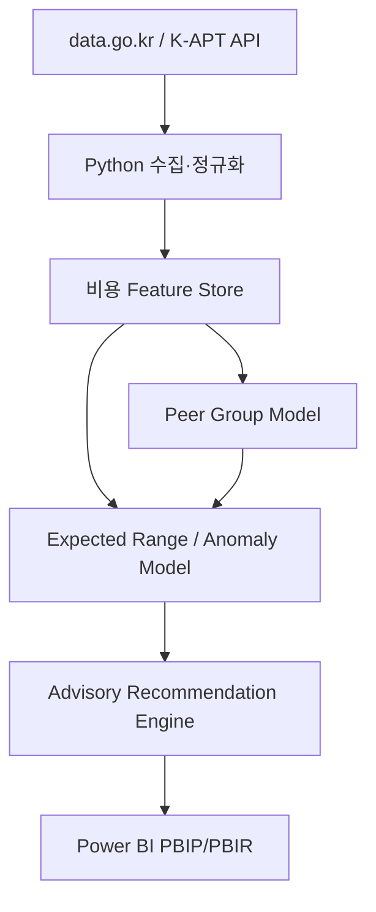
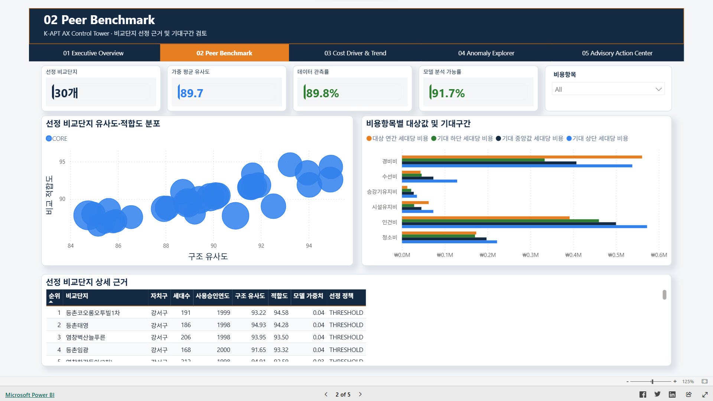
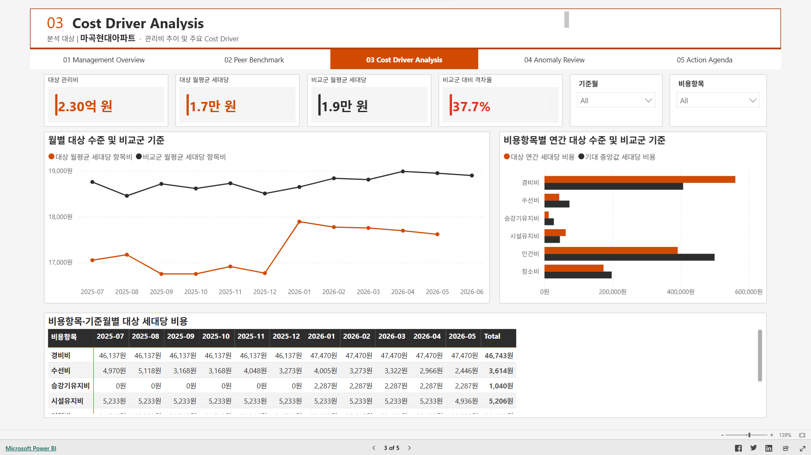
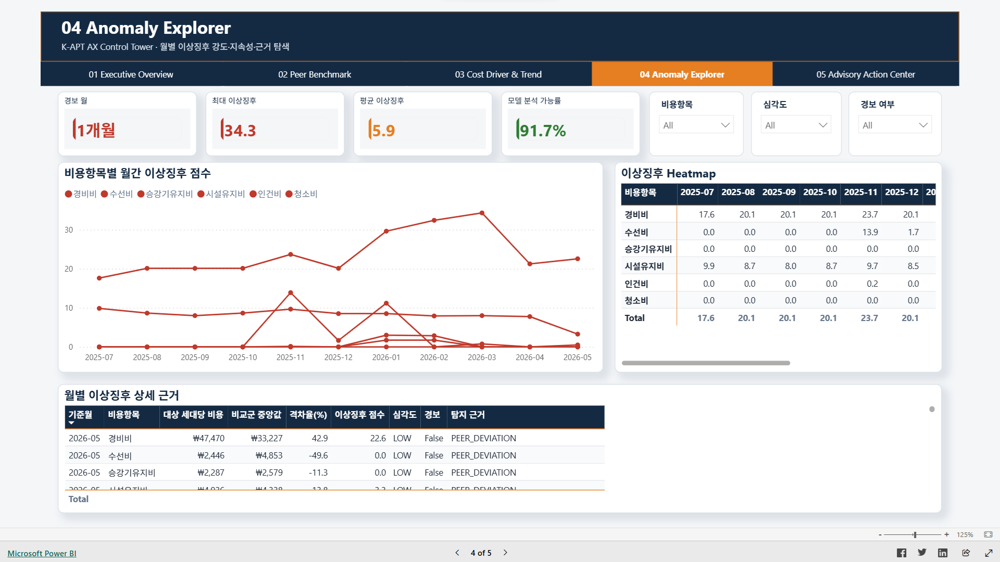
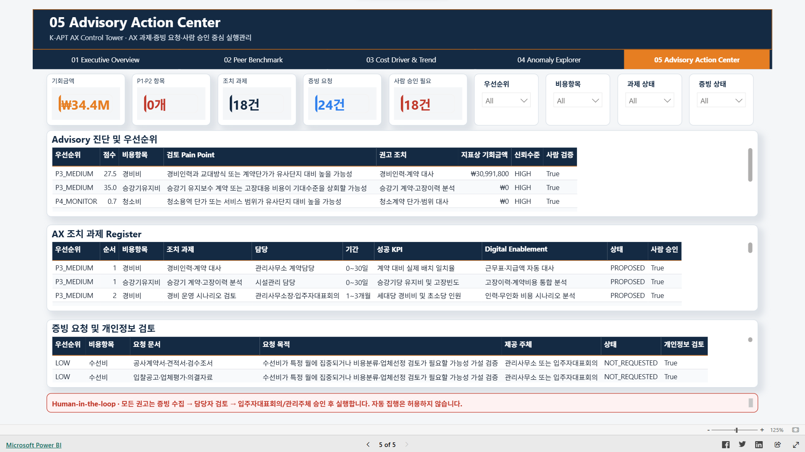

# K-APT 관리비 AX Control Tower

K-APT 공개데이터를 활용해 관리비 이상징후를 찾고, 이를 증빙 검토와 담당자 승인 절차로 연결하는 AX Advisory 제안서입니다.

## Project Links

- [제안서 PDF](docs/KAPT_AX_Control_Tower_Proposal_Portfolio.pdf)
- [Live Power BI](https://app.powerbi.com/view?r=eyJrIjoiZmI3MzRiN2MtM2UxZC00NjI1LWFmZGUtNTY5YmRlNjAxMWViIiwidCI6IjNkMTJhMjg3LWI5N2QtNGMwZC05OTczLWY4YmY5ODAyNGQ4OSJ9&embedImagePlaceholder=true&pageName=93921544bf1082b9775a)
- [Notion Page](https://zinc-profit-14c.notion.site/K-APT-AX-Control-Tower-3a394df2b3b281c083ebd9306fe6ced5)

[](https://app.powerbi.com/view?r=eyJrIjoiZmI3MzRiN2MtM2UxZC00NjI1LWFmZGUtNTY5YmRlNjAxMWViIiwidCI6IjNkMTJhMjg3LWI5N2QtNGMwZC05OTczLWY4YmY5ODAyNGQ4OSJ9&embedImagePlaceholder=true&pageName=93921544bf1082b9775a)

> 공개 데모는 로그인 없이 사용할 수 있습니다. 이미지 또는 위 링크를 클릭하면 비교단지, 비용 추이, 이상징후 및 AX 조치 과제를 직접 탐색할 수 있습니다.

- [AX Advisory 프로젝트 브리프](docs/reports/pilot_ax_advisory_brief.md)
- [Power BI 검증 체크리스트](docs/powerbi_validation_checklist.md)
- [비교단지 모델 카드](docs/model_cards/peer_group_model.md)
- [이상징후 모델 카드](docs/model_cards/anomaly_detection_model.md)

> 이 저장소는 개인 포트폴리오이며 삼일PwC, 한국부동산원 또는 공공기관의 공식 프로젝트가 아닙니다. 화면의 지표상 절감 검토액과 권고는 공개데이터 기반의 검토 신호이며 감사의견·부정 판정·확정 절감액이 아닙니다.

## 1. 해결하려는 문제

[K-APT 공동주택관리정보시스템](https://www.k-apt.go.kr/)은 단지와 관리비 정보를 공개하지만, 개별 단지의 의사결정자는 다음 질문에 바로 답하기 어렵습니다.

- 우리 단지의 비용은 구조적으로 유사한 단지보다 높은가?
- 일시적 변동과 지속적인 이상징후를 어떻게 구분할 것인가?
- 어떤 계약·원장·운영 자료를 먼저 확인해야 하는가?
- 분석 결과를 누가, 언제까지, 어떤 통제 아래 실행할 것인가?

K-APT AX Control Tower는 공개데이터만으로 확정 결론을 내리지 않고, 사람이 검증할 수 있는 근거와 후속 과제를 생성합니다.

## 2. AX Advisory 가치 흐름



| Pain point | 분석/AX 기능 | 의사결정 산출물 |
|---|---|---|
| 단순 전국·지역 평균의 왜곡 | 세대수·사용승인연도·관리형태 등 구조 유사도 기반 비교군 | 비교단지와 선정 근거 |
| 월별 변동에 대한 과잉 반응 | 가중 비교군, 기대범위, 지속성 신호 결합 | 항목별 이상징후 점수와 사유 |
| 숫자만 있고 다음 행동이 없음 | 규칙 기반 Advisory 추천 엔진 | 담당자·기간·KPI가 포함된 조치 과제 |
| 근거 없는 비용 절감 주장 | 계약서·원장·운영이력 등 증빙 요청 | 검증 가능한 evidence request |
| AI 권고의 무통제 실행 | Human-in-the-loop와 자동실행 금지 | 사람 승인 필요 여부와 책임 추적 |

### 개인 구현 범위

본 프로젝트는 문제 정의부터 공개 데모 배포까지 전 과정을 개인 프로젝트로 수행했습니다.

- K-APT 기반 AX Advisory use case 및 통제 원칙 설계
- 공공데이터 API 수집, 정규화 및 재시도 파이프라인 구현
- 구조 유사도 기반 비교단지 선정 모델 구현
- 기대범위 및 복합 이상징후 탐지 모델 구현
- 검토 가설, 권고 조치 및 증빙 요청 생성
- Power BI 스타 스키마, DAX 측정값 및 6개 보고서 페이지 설계
- PBIP/PBIR/TMDL 기반 Git 버전 관리
- Python 및 Microsoft CLI 기반 Power BI 프로젝트 QA
- Power BI Service 공개 데모 게시

## 3. 현재 분석 스냅샷

기준 스냅샷은 **2026-07-20 생성**, 비용 관측기간은 **2025-07~2026-06**입니다.

| 항목 | 현재 값 |
|---|---:|
| 서울 공동주택 마스터 | 3,384개 단지 |
| 파일럿 코호트 | 50개 단지 |
| 대상 단지 | 마곡현대아파트 |
| 분석 비용항목 | 6개 |
| 월별 비용 Fact | 3,600행 |
| 모델 선정 비교단지 | 30개 |
| 가중 평균 구조 유사도 | 89.7점 |
| 대상단지 연환산 분석대상 공용관리비 | 약 2.51억 원 |
| 지표상 연간 절감 검토액 | 약 3.4천만 원 |
| 이상징후 경보 | 1건 |
| Advisory 조치 / 증빙 요청 | 18개 / 24개 |

> **대상 단지 및 분석 범위**
>
> 본 프로젝트의 대상은 K-APT에 `마곡현대아파트`로 등록된 서울특별시 강서구 양천로 140 소재 단지이며, 외부 부동산·지도 서비스에서는 `마곡현대2차아파트`로도 표기됩니다. 데이터 정합성을 위해 모델과 산출물에는 K-APT 원천 명칭인 `마곡현대아파트`를 사용합니다.
>
> K-APT가 공개하는 관리비 관련 금액은 공용관리비뿐 아니라 사용료와 장기수선충당금 등 서로 다른 성격의 항목으로 구성됩니다. 본 프로젝트는 전체 관리비 합계가 아니라 관리주체의 운영 효율성과 상대적으로 직접 관련된 공용관리비 6개 항목—인건비, 청소비, 경비비, 승강기유지비, 수선비, 시설유지비—만을 분석합니다. 개별 사용량의 영향을 크게 받는 전기료·수도료 등의 사용료와 미래의 주요 시설 교체·보수를 위해 적립하는 장기수선충당금, 그 밖의 공용관리비 항목은 분석 범위에서 제외합니다. 따라서 대시보드 금액은 K-APT 화면의 전체 관리비 등 합계와 일치하지 않습니다.
>
> 인건비는 K-APT 일반관리비 전체가 아니라 급여·제수당·상여금·퇴직급여·사회보험료·복리후생비를 합산한 분석항목입니다. 수선비와 시설유지비는 K-APT 수선유지비 계열의 세부 원천항목을 분석 목적으로 구분한 값입니다.
>
> **근거 및 원천**
> - [K-APT 공동주택관리정보시스템](https://www.k-apt.go.kr/)
> - [공동주택관리법 시행령 제23조 — 관리비, 사용료 및 장기수선충당금의 구분](https://www.law.go.kr/LSW/lsLinkCommonInfo.do?chrClsCd=010202&lsJoLnkSeq=1027726065)
> - [공동주택관리법 시행령 별표 2 — 관리비 비목별 세부명세](https://www.law.go.kr/법령/공동주택관리법시행령)

절감 검토액의 주요 구성은 경비비 약 3,099만 원과 시설유지비 약 345만 원입니다. 이는 실현 가능성이 검증된 절감액이 아니라 계약 범위, 인력 운영, 원장 및 설비 이력을 우선 검토하기 위한 선별 지표입니다. 현재 조치 18건은 모두 사람 승인이 필요하며 자동 실행은 허용하지 않습니다.


## 4. 분석 구조



- **수집·정규화:** 단지 목록, 단지 기본정보, 공용관리비를 재실행 가능한 CSV/JSON으로 변환
- **비교단지 모델:** 구조 유사도와 데이터 관측률을 결합해 비교군과 가중치 산출
- **기대범위 모델:** 비교군의 가중 분포로 비용항목별 기대 하단·중앙·상단 계산
- **이상징후 모델:** 횡단면, 기대범위 초과, 시계열 변화, 지속성 신호를 결합
- **Advisory 엔진:** 우선순위, 가설, 권고, 실행 과제, 증빙 요청을 분리 생성
- **Power BI:** 스타 스키마와 DAX 측정값으로 의사결정 화면 제공

## 5. Power BI 보고서

보고서는 Git 친화적인 **PBIP/PBIR + TMDL** 형식으로 버전 관리합니다.

| 페이지 | 주요 의사결정 |
|---|---|
| `01 Management Overview` | 지표상 절감 검토액, 우선 검토 항목과 주요 시사점 |
| `02 Peer Benchmark` | 비교단지 선정의 타당성, 유사도·가중치·관측률 확인 |
| `03 Cost Driver Analysis` | 비용항목별 대상/비교군 격차, 월별 추이와 Cost Driver |
| `04 Anomaly Review` | 이상징후 수준·지속성·근거와 우선 검토 관점 |
| `05 Action Agenda` | Action Item, Owner, Time horizon, 증빙 및 Governance |
| `00 Model QA` | 행 수, 관측률, 기대범위, 모델 상태 검증용 숨김 페이지 |

전체 6페이지(사용자 화면 5 + 숨김 QA 1), 89개 시각화가 생성됩니다. 현재 공개 스냅샷은 모델·이상징후·Advisory 산출물이 완성된 마곡현대아파트 1개를 대상으로 하며, 분석 대상은 모든 사용자 페이지 상단에 11pt Bold로 고정 표시합니다. 다중 단지 선택기는 각 단지에 대한 동일 산출물을 생성한 뒤 확장합니다. 금액 카드는 `2.51억 원`, `3.4천만 원`처럼 한국어 단위를 사용하고, 범주형 차트는 구분 색상을 적용합니다.

공개된 PwC Consulting 보고서의 정보 계층과 시각 원칙을 참고해 흰 배경, 차콜 텍스트, 오렌지 섹션 번호, 엷은 제목과 시사점 중심 문구를 적용했습니다. PwC 로고·서식을 복제하지 않으며, 본 저장소는 개인 포트폴리오입니다.

### Power BI Desktop에서 열기

1. Power BI Desktop을 종료한 상태에서 저장소를 최신화합니다.
2. `powerbi/KAPT_AX_Control_Tower.pbip`를 엽니다.
3. 경로 입력을 요구하면 `pDataRoot`를 로컬 저장소의 절대경로인 `...\kapt-ax-control-tower\powerbi\data`로 설정합니다.
4. **Home > Refresh**를 실행합니다.
5. 5개 사용자 페이지와 숨김 QA 페이지의 카드·차트·필터를 확인한 뒤 저장합니다.

Power BI Desktop의 로컬 사용자 설정 파일은 저장소에 포함하지 않습니다. 상세 확인 항목은 [Power BI 검증 체크리스트](docs/powerbi_validation_checklist.md)를 참고하세요.

### 주요 화면

<details>
<summary>01 Management Overview</summary>


</details>

<details>
<summary>02 Peer Benchmark</summary>



</details>

<details>
<summary>03 Cost Driver Analysis</summary>



</details>

<details>
<summary>04 Anomaly Review</summary>



</details>

<details>
<summary>05 Action Agenda</summary>



</details>

## 6. 개발 환경

- Python 3.14.6
- Power BI Desktop (PBIP/PBIR 미리 보기 기능 사용)
- Node.js 18 이상: Power BI 보고서 정의 재생성용
- Git / GitHub

```powershell
git clone https://github.com/hahnjune0118/kapt-ax-control-tower.git
cd kapt-ax-control-tower
py -3.14 -m venv .venv
.\.venv\Scripts\Activate.ps1
python -m pip install --upgrade pip
python -m pip install -r requirements.txt
Copy-Item .env.example .env
```

`.env`에는 본인의 공공데이터포털 일반 인증키(Decoding)를 저장합니다. 실제 `.env`는 Git에 포함하지 않습니다.

## 7. 데이터·모델 파이프라인 재실행

아래 명령은 저장소 루트에서 순서대로 실행합니다.

```powershell
python src\check_env.py
python src\ingestion\fetch_apt_list_full.py
python src\transformation\normalize_apt_list.py
python src\ingestion\fetch_apt_profile_bulk.py
python src\transformation\normalize_apt_profile.py
python src\features\select_pilot_cohort.py
python src\ingestion\fetch_common_cost_bulk.py
python src\transformation\normalize_common_cost.py
python src\features\build_cost_features.py
python src\models\build_peer_group_model.py
python src\models\build_anomaly_model.py
python src\reporting\build_advisory_recommendations.py
python src\reporting\export_powerbi_snapshot.py
```

API 재수집은 공공데이터포털 호출 제한과 K-APT 응답 상태의 영향을 받습니다. 실패 파일과 체크포인트를 보존하므로 동일 명령으로 실패 건만 재시도할 수 있습니다.

## 8. 보고서 자동 생성 및 품질검증

Power BI Desktop에서 도형과 시각화를 하나씩 배치하지 않아도 되도록 보고서 정의를 코드로 생성합니다.

```powershell
node scripts\build_powerbi_report.mjs
python scripts\validate_powerbi_project.py
npx --yes @microsoft/powerbi-report-authoring-cli@latest validate powerbi\KAPT_AX_Control_Tower.Report --pretty
```

- `build_powerbi_report.mjs`: 페이지, 시각화, 테마, 내비게이터를 결정론적으로 생성
- `validate_powerbi_project.py`: PBIR↔TMDL 필드 참조, 관계, 캔버스, CSV 행 수·키·해시 검증
- Microsoft CLI: 공식 PBIR 스키마와 시각화 역할 검증

CLI가 외부 JSON Schema에 접근할 수 없는 네트워크에서는 `PBIR_SCHEMA_UNREACHABLE` 경고가 발생할 수 있습니다. 구조 오류가 0건이고 로컬 QA가 통과하면 보고서 자체 오류와 구분해서 판단합니다.

## 9. Responsible AI 원칙

- 공개데이터만으로 부정행위나 관리 실패를 판정하지 않습니다.
- 모든 분석 화면에 기준시점·데이터 범위·비교 근거를 남깁니다.
- `절감 가능액`처럼 실현 가능성을 암시하는 표현 대신 `지표상 절감 검토액`을 사용하며, 확정 절감액으로 표현하지 않습니다.
- 계약 변경, 업체 선정, 인력 조정, 비용 집행은 사람이 증빙을 확인하고 승인합니다.
- 권고와 조치에는 소유자, 기간, KPI, 승인 필요 여부를 기록합니다.
- 개인정보가 포함될 수 있는 추가 증빙은 별도 검토 후 취급합니다.

## 10. 저장소 구조

```text
configs/                   분석 설정
data/                      원천·가공 데이터(민감/대용량 파일은 Git 제외)
docs/                      프로젝트·모델·Power BI 문서
powerbi/
  data/                    공개 포트폴리오 스냅샷
  KAPT_AX_Control_Tower.Report/
  KAPT_AX_Control_Tower.SemanticModel/
  KAPT_AX_Control_Tower.pbip
scripts/                   PBIR 생성 및 프로젝트 QA
src/                       수집·변환·feature·model·reporting 코드
```

## 11. 한계와 다음 확장

- 현재 파일럿은 서울 단일 대상 단지와 6개 관리비 항목에 초점을 둡니다.
- K-APT 공개데이터만으로 계약조건, 서비스 수준, 시설상태를 직접 관측할 수 없습니다.
- 이상징후 점수는 검토 우선순위이며 인과관계나 책임을 증명하지 않습니다.
- Power BI Service 게시와 공개 인터랙티브 데모 구축까지 완료했습니다.
- 다음 확장은 예약 데이터 갱신, 실제 증빙 수집 워크플로, 권고 과제 상태관리 및 사용자 피드백 기반 모델 모니터링입니다.
